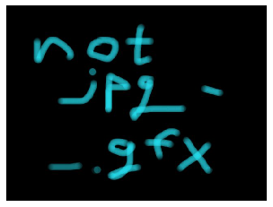
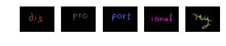

继续挑战

---
### 第12题地址[evil.html](http://www.pythonchallenge.com/pc/return/evil.html)
* 
* 网页标题是`dealing evil`，源码中没有隐藏信息

又是一题图片题，不过这回的题目就有点晦涩了。<br>
图片内容是在分扑克牌，并不知道是什么意思。结合标题也猜不到。<br>

寻找一下题目的蛛丝马迹：发现图片的文件名是`evil1.jpg`，那是不是会有`evil2.jpg` `evil3.jpg`等等？

**结果真的有**：


```python
from io import BytesIO
import requests
from PIL import Image
from matplotlib import pyplot as plt
%matplotlib inline

with requests.Session() as sess:
    sess.auth = ('huge', 'file')
    response = sess.get('http://www.pythonchallenge.com/pc/return/evil2.jpg').content
    img = Image.open(BytesIO(response))
    print('evil2.jpg:')
    plt.imshow(img)
    plt.axis('off')
    plt.show()
    response = sess.get('http://www.pythonchallenge.com/pc/return/evil3.jpg').content
    img = Image.open(BytesIO(response))
    print('evil3.jpg:')
    plt.imshow(img)
    plt.axis('off')
    plt.show()
    response = sess.get('http://www.pythonchallenge.com/pc/return/evil4.jpg').text
    print('evil4.jpg:')
    print(response)
    response = sess.get('http://www.pythonchallenge.com/pc/return/evil5.jpg').text
    print('evil5.jpg:')
    print(response)
```

    evil2.jpg:
    





    evil3.jpg:
    


    evil4.jpg:
    Bert is evil! go back!
    
    evil5.jpg:
    <html><head><title>404 Not Found</title></head>
    <body bgcolor=white>
    <h1>404 Not Found</h1>
    
    The requested URL /pc/return/evil5.jpg does not exist.
    
    </body></html>
    
    

其中`evil2.jpg`提示说不是`jpg`而是`gfx`，说明隐藏信息为`evil2.gfx`文件<br>
`evil3.jpg`提示说没有更多的`evil`了，但——<br>
`evil4.jpg`不是图片，而是一段文字`Bert is evil! go back!`<br>
`evil5.jpg`提示404错误了，说明确实没有`evil`了

既然这样，就先把文件下载回来研究一下吧：


```python
with requests.Session() as sess:
    sess.auth = ('huge', 'file')
    response = sess.get('http://www.pythonchallenge.com/pc/return/evil2.gfx').content
print(response[:50])
```

    b'\xff\x89G\x89\xff\xd8PIP\xd8\xffNFN\xff\xe0G8G\xe0\x00\r7\r\x00\x10\na\n\x10J\x1a@\x1aJF\n\x01\nFI\x00\xf0\x00IF\x00\x00\x00F'
    

我们可以看到这个文件的前面若干个字节中间隔地隐藏着`GIF` `PNG` `JFIF`等常用图片格式的文件头标识，目测这个文件是将几张图片的信息交叉合并起来的。<br>
就拿`GIF`来看，前面的`G` `I` `F`三个字符分别间隔4个字节（其他的也类似），再回头来看题目中那张奇怪的分扑克牌图片，<br>
这回结合标题仔细一想就能明白个大概了：<br>
> `evil2.gfx`这个文件就是所谓的`evil`，而我们需要对这个`evil`进行处理（deal），处理方法就跟图片中分扑克牌那样——分成5堆，
> 也就是准备5个容器，按分牌的方式，依次将每个字节放入这5个容器，根据文件头的指示，这5个容器应该分别对应于一张图片。


```python
from PIL import ImageFile
ImageFile.LOAD_TRUNCATED_IMAGES = True

for i in range(5):
    img = Image.open(BytesIO(response[i::5]))
    plt.subplot(1, 5, i + 1)
    plt.imshow(img)
    plt.axis('off')
```





代码中`ImageFile.LOAD_TRUNCATED_IMAGES = True`是因为第4张图片不完整，需要在图片后自动补充`\x00`以显示完整。<br>
从以上结果可以看出来分块的结果是`disproportional`<del>ity</del>，修改地址为[disproportional.html](http://www.pythonchallenge.com/pc/return/disproportional.html)，来到了下一题。

### 总结：作为程序员对于像`evil1`这种文字就要敏感到会有`evil2` `evil3`等等的信息，而且对于明文告诉你后面没有了的信息也要考虑到可能是欺骗信息:)。要多试试才会发现更多的新大陆。
###### 本题代码地址[12_evil.ipynb](https://github.com/StevenPZChan/pythonchallenge/blob/notebook/nbfiles/12_evil.ipynb)
